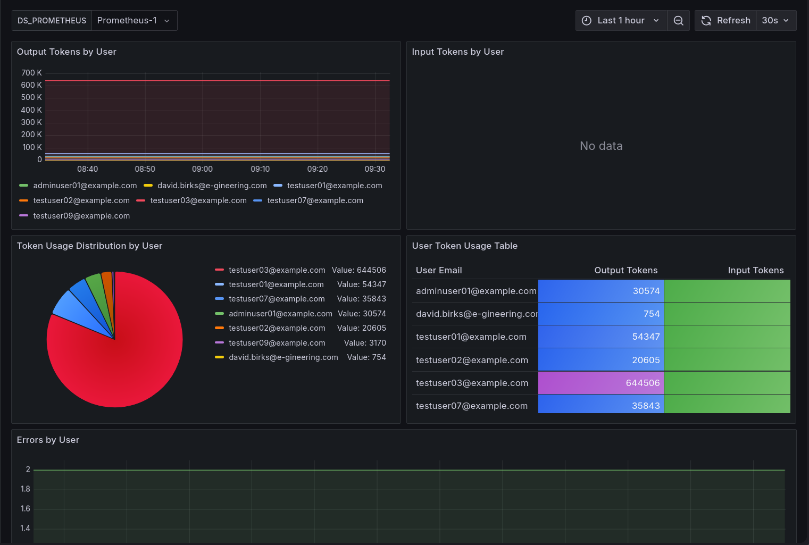

# LibreChat Metrics Exporter

This tool collects and exposes various metrics from [LibreChat](https://www.librechat.ai) for monitoring via Prometheus or other tools compatible with the OpenMetrics format.


## Grafana Dashboard



## Overview

The script connects to the MongoDB database used by LibreChat, aggregates relevant data, and exposes the metrics on an HTTP server that Prometheus can scrape.

## Features

- Collects metrics such as:
  - **Unique users per day**
  - **Average and standard deviation of users per day**
  - **Average and standard deviation of messages per user**
  - **Messages per model per day**
  - **Average and standard deviation of messages per model per day**
- Exposes metrics for Prometheus to scrape
- Designed to run continuously, collecting metrics at regular intervals

## Prerequisites

- **uv**
- Access to the **LibreChat MongoDB** database
- **Prometheus** installed and configured to scrape the metrics endpoint

## Setup Instructions

### 1. Clone the Repository

Clone the repository containing the script:

```bash
git clone https://github.com/yourusername/librechat_exporter.git
cd librechat_exporter
```

### 2. Install Dependencies

Install the required Python packages using uv:

```sh
uv sync
```

### 3. Configure the Environment Variables

You can change the default configuration via environment variables.
You can either set then directly, or add them to the `.env` file.
Available configurations are:

```sh
# Configure database connection
MONGODB_URI=mongodb://mongodb:27017/

# Configure log level
LOGGING_LEVEL=info

# Configure log format
LOGGING_FORMAT="%(asctime)s - %(levelname)s - %(message)s"

# Specify Mongo Database - Optional. Defaults to "LibreChat"
MONGODB_DATABASE=librechat
```

### 4. Run the Script

Start the metrics collection script:

```sh
uv run metrics.py
```

The script will start an HTTP server to expose the metrics.

### 5. Configure Prometheus

Add the following job to your Prometheus configuration file (prometheus.yml):scrape_configs:

```yaml
- job_name: 'librechat_metrics'
  scrape_interval: 60s
  static_configs:
    - targets:
        - 'localhost:8000'
```

Reload Prometheus to apply the new configuration.

## Docker Deployment

A Dockerfile is included for containerized deployment.

If you want to run the script inside the mongodb librechat container, you can add something like this to the librechat docker compose:

```yaml
metrics:
  image: ghcr.io/e-gineering/librechat_exporter:main
  networks:
    - librechat
  depends_on:
    - mongodb
  ports:
    - "8000:8000"  # Expose port for Prometheus
  environment:
    - MONGODB_URI=mongodb://mongodb:27017/
    - LOGGING_LEVEL=info
  restart: unless-stopped
```

Make sure the networks attribute is the same as your mongodb container.

## Metrics

The exporter provides the following metrics specific to LibreChat:

```sh
# HELP librechat_messages_total Number of sent messages stored in the database
# TYPE librechat_messages_total gauge
librechat_messages_total 9.0

# HELP librechat_error_messages_total Number of error messages stored in the database
# TYPE librechat_error_messages_total counter
librechat_error_messages_total 0.0

# HELP librechat_input_tokens_total Number of input tokens processed
# TYPE librechat_input_tokens_total gauge
librechat_input_tokens_total 0.0

# HELP librechat_output_tokens_total Total number of output tokens generated
# TYPE librechat_output_tokens_total gauge
librechat_output_tokens_total 0.0

# HELP librechat_conversations_total Number of started conversations stored in the database
# TYPE librechat_conversations_total gauge
librechat_conversations_total 0.0

# HELP librechat_messages_per_model_total Number of messages per model and user
# TYPE librechat_messages_per_model_total gauge
librechat_messages_per_model_total{model="gpt-4",user_email="user@example.com"} 9.0

# HELP librechat_errors_per_model_total Number of error messages per model and user
# TYPE librechat_errors_per_model_total counter
librechat_errors_per_model_total{model="gpt-4",user_email="user@example.com"} 0.0

# HELP librechat_input_tokens_per_model_total Number of input tokens per model and user
# TYPE librechat_input_tokens_per_model_total gauge
librechat_input_tokens_per_model_total{model="gpt-4",user_email="user@example.com"} 1500.0

# HELP librechat_output_tokens_per_model_total Number of output tokens per model and user
# TYPE librechat_output_tokens_per_model_total gauge
librechat_output_tokens_per_model_total{model="gpt-4",user_email="user@example.com"} 2000.0

# HELP librechat_usage_cost_total_usd Total API usage costs in USD
# TYPE librechat_usage_cost_total_usd counter
librechat_usage_cost_total_usd{model="gpt-4",user_email="user@example.com"} 0.0450

# HELP librechat_active_users Number of active users in the last 5 minutes
# TYPE librechat_active_users gauge
librechat_active_users 2.0

# HELP librechat_active_conversations Number of active conversations in the last 5 minutes
# TYPE librechat_active_conversations gauge
librechat_active_conversations 0.0

# HELP librechat_uploaded_files_total Number of uploaded files
# TYPE librechat_uploaded_files_total counter
librechat_uploaded_files_total 1.0

# HELP librechat_registered_users_total Number of registered users
# TYPE librechat_registered_users_total counter
librechat_registered_users_total 1.0

# HELP librechat_daily_unique_users Number of unique users active in the current day
# TYPE librechat_daily_unique_users gauge
librechat_daily_unique_users 2.0

# HELP librechat_weekly_unique_users Number of unique users active in the current week (starting from Monday)
# TYPE librechat_weekly_unique_users gauge
librechat_weekly_unique_users 3.0

# HELP librechat_monthly_unique_users Number of unique users active in the current month
# TYPE librechat_monthly_unique_users gauge
librechat_monthly_unique_users 4.0

# HELP librechat_messages_5m Number of messages sent in the last 5 minutes
# TYPE librechat_messages_5m gauge
librechat_messages_5m 5.0

# HELP librechat_messages_per_model_5m Number of messages per model in the last 5 minutes
# TYPE librechat_messages_per_model_5m gauge
librechat_messages_per_model_5m{model="gpt-4"} 3.0

# HELP librechat_input_tokens_5m Number of input tokens used in the last 5 minutes
# TYPE librechat_input_tokens_5m gauge
librechat_input_tokens_5m 100.0

# HELP librechat_output_tokens_5m Number of output tokens generated in the last 5 minutes
# TYPE librechat_output_tokens_5m gauge
librechat_output_tokens_5m 200.0

# HELP librechat_model_input_tokens_5m Input tokens per model in the last 5 minutes
# TYPE librechat_model_input_tokens_5m gauge
librechat_model_input_tokens_5m{model="gpt-4"} 50.0

# HELP librechat_model_output_tokens_5m Output tokens per model in the last 5 minutes
# TYPE librechat_model_output_tokens_5m gauge
librechat_model_output_tokens_5m{model="gpt-4"} 100.0

# HELP librechat_error_messages_5m Number of error messages in the last 5 minutes
# TYPE librechat_error_messages_5m gauge
librechat_error_messages_5m 0.0

# HELP librechat_errors_per_model_5m Number of error messages per model in the last 5 minutes
# TYPE librechat_errors_per_model_5m gauge
librechat_errors_per_model_5m{model="gpt-4"} 0.0
```

## Development

For development, start a MongoDB:

```sh
# Using Docker
docker run -d -p 127.0.0.1:27017:27017 --name mongo mongo
# Using Podman
podman run -d -p 127.0.0.1:27017:27017 --name mongo mongo
```

Install the dependencies:

```sh
uv sync
```

Run the metrics exporter:

```sh
uv run metrics.py
```

Query the metrics endpoint:

```sh
curl -sf http://localhost:8000
```

## Historical Data Analysis

For historical data analysis, use Prometheus with appropriate retention settings to store and query historical metrics data over time. Prometheus provides powerful querying capabilities with PromQL and integrates seamlessly with Grafana for visualization.
